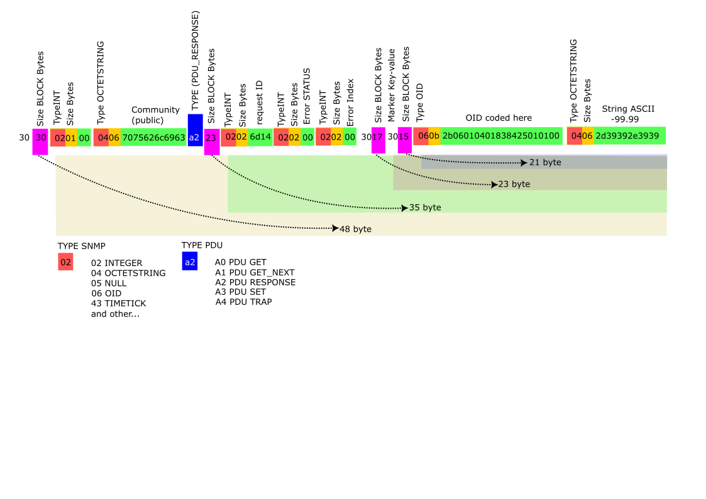

### Цель данного скетча - отдавать данные о температуре с датчика DS18b20 через протокол SNMP.
Я использую сетевую карту Ethernet Nano V3 ENC28J60 дя Arduino nano, ни одна из имеющихся библиотек SNMP не заработала нормально. ПОэтому пришлось написать очень простую реализацию, которая представляет только ответ на 4 оида, и только на запрос GET а коммьюнити ему вообще не важен.
Использованные оиды:
* 1.3.6.1.2.1.1.1.0 = White-DS2SNMP название
* 1.3.6.1.2.1.1.3.0   Timetick показывает аптайм
* 1.3.6.1.2.1.1.5.0 = White-DS2SNMP дескрипшн
* 1.3.6.1.4.1.49701.1.1.0 = -99.99 шесть байт строковой вывод температуры с датчика

Никаких SNMPWALK никаких SNMPGETNEXT только SNMPGET

Данный код не содержит высогого програмистского стиля.

Далее приложу структуру пакета чтоб не забыть:

The purpose of this sketch is to provide temperature data from the DS18b20 sensor via the SNMP protocol.
I am using a Nano V3 ENC28J60 Ethernet network card for an Arduino nano, none of the available SNMP libraries worked fine. Therefore, I had to write a very simple implementation that represents only the answer to 4 oids, and only to a GET request, and the community is not important to him at all.
Used oids:
* 1.3.6.1.2.1.1.1.0 = White-DS2SNMP name
* 1.3.6.1.2.1.1.3.0 Timetick shows uptime
* 1.3.6.1.2.1.1.5.0 = White-DS2SNMP description
* 1.3.6.1.4.1.49701.1.1.0 = -99.99 six bytes string temperature output from the sensor

No SNMPWALK no SNMPGETNEXT only SNMPGET

This code does not contain a high programming style. it's just code.
